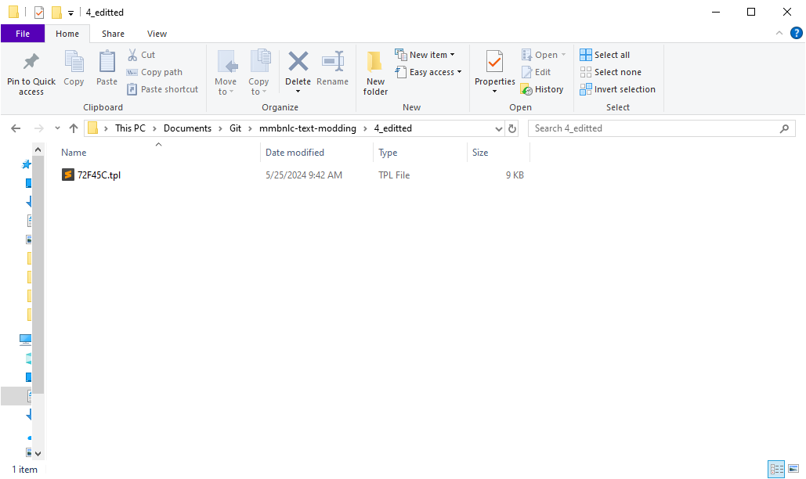

# Editing Scripts

1. Open `.\2_extracted\message_eng.tpl`
2. Find the script you want to edit  
&nbsp;&nbsp;&nbsp;&nbsp;For Example in MMBN3 White cmd-f for `bookcase` gives you:  
  
3. Scroll up to find it's `@archive` value  
&nbsp;&nbsp;&nbsp;&nbsp;The `bookcase` example has an `@archive` value of `72F45C`:
  
4. Copy `@archive.tpl` from `.\2_extracted\message_eng_tpl\` to `.\4_editted\`  
&nbsp;&nbsp;&nbsp;&nbsp;In the `bookcase` example, this is the file: `72F45C.tpl`  
  
5. It's recommened to remove all scripts from `.\4_editted\@archive.tpl` you don't want to edit  
  
6. Edit `.\4_editted\@archive.tpl` as desired  
&nbsp;&nbsp;&nbsp;&nbsp;Let's update the text, and add some back 'n' forth...  
  
