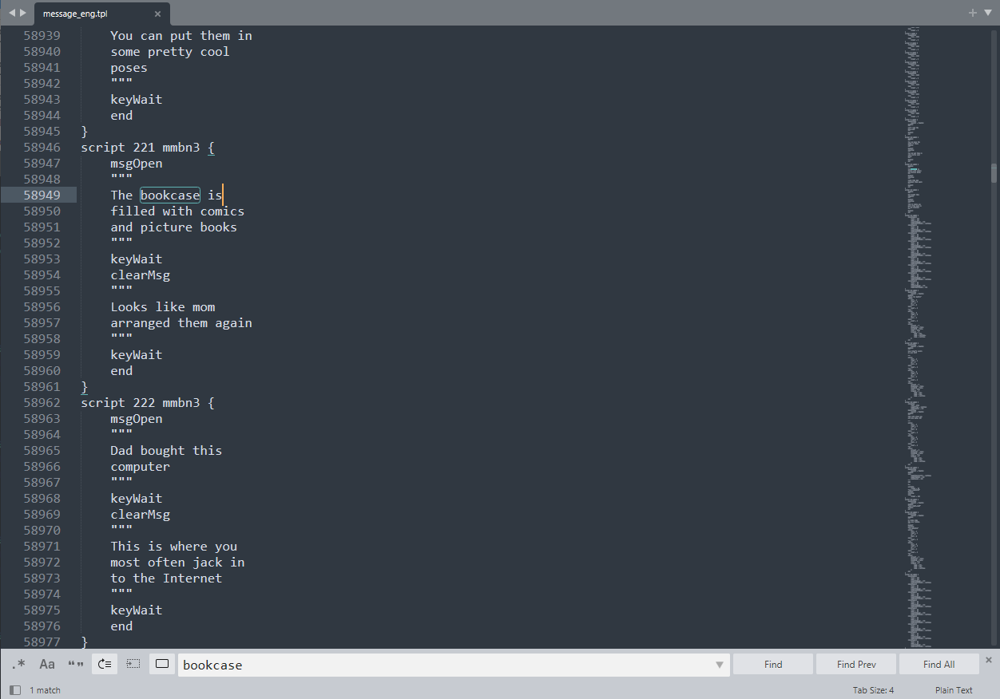

# Slow Start

Detailed guide for Mega Man Battle Network Legacy Collection (MMBNLC) Text Modding.

## Prerequisites

[7-Zip](https://www.7-zip.org/download.html)  
[Python 3](https://www.python.org/downloads/)  
&nbsp;&nbsp;&nbsp;&nbsp;Added to the path as `python3`  
[.NET 4.8.1](https://dotnet.microsoft.com/en-us/download/dotnet-framework/net481)

## Modding Text

Files and Folders are ordered by when they should be interacted with. In general, one should start with `1_` and end with `7_`.

### [1_extractor.bat](./1_extractor.bat)

Double click `1_extractor.bat`.  
At the first option, type the number [0-9] relating to the game you want to text mod.  
&nbsp;&nbsp;&nbsp;&nbsp;For Example we can type `2` for MMBN 3 White.  
  
Press any key to close the command prompt.  

### 2_extracted

After extraction, there should be a folder named `2_extracted`. This folder contains files pulled from MMBNLC.  
  

#### exeZ

An extracted folder of the exeZ.bat file, containing all the message scripts for the game.  
The `Z` will be replaced with the game-appropriate suffix. By game these suffixes should be:

| Game | Suffix | exeZ.bat |
| -------- | ------- | ------- |
| MMBN 1 | 1 | exe1.bat |
| MMBN 2 | 2j | exe2j.bat |
| MMBN 3 White | 3 | exe3.bat |
| MMBN 3 Blue | 3b | exe3b.bat |
| MMBN 4 Red Sun | 4 | exe4.bat |
| MMBN 4 Blue Moon | 4b | exe4b.bat |
| MMBN 5 Protoman | 5 | exe5.bat |
| MMBN 5 Colonel | 5k | exe5k.bat |
| MMBN 6 Gregar | 6 | exe6.bat |
| MMBN 6 Falzer | 6 | exe6f.bat |

#### message_eng_msg

Contains all the `message_eng` scripts saved as .msg files. This is not human readable.

#### message_eng_tpl

The same `message_eng` scripts, saved as tpl files. These are human readable. 

#### exeZ.dat

This is the .dat file pulled directly from MMBNLC. It's recommend that you do your own backups, but this file should be a backup as well. 

#### message_eng.tpl

This is a human readable file containing all the `message_eng` scripts. It's useful for finding a script one wants to edit. 

### [3_edit_file.md](./3_edit_files.md) and [4_editted](./4_editted)

1. Open `.\2_extracted\message_eng.tpl`
2. Find the script you want to edit  
&nbsp;&nbsp;&nbsp;&nbsp;For Example in MMBN3 White cmd-f for `bookcase` gives you:  
  
3. Scroll up to find it's `@archive` value  
&nbsp;&nbsp;&nbsp;&nbsp;The `bookcase` example has an `@archive` value of `72F45C`:
  
4. Copy `@archive.tpl` from `.\2_extracted\message_eng_tpl\` to `.\4_editted\`  
&nbsp;&nbsp;&nbsp;&nbsp;In the `bookcase` example, this is the file: `72F45C.tpl`  
  
5. It's recommened to remove all scripts from `.\4_editted\@archive.tpl` you don't want to edit  
  
6. Edit `.\4_editted\@archive.tpl` as desired  
&nbsp;&nbsp;&nbsp;&nbsp;Let's update the text, and add some back 'n' forth...  
  

### [5_repacker.bat](./5_repacker.bat)

Make sure MMBNLC is not running, as we can't change game files while they are in use.  
Double click `5_repacker.bat`.  
Press any key to close the command prompt.  
## Your game should now be patched!

#### Verifying that the game was patched

Open Steam  
Right click MMBNLC  
Manage  
Browse local Files  
Navigate through exe/data/
The exeZ.bat.bak is the original file, while exeZ.bat should be modified now. 
  

### 6_repacked

This folder contains the patched results. 

#### exeZ\data\msg\message_eng.map

The newly patched `message_eng.map`.

#### exeZ\data\msg\message_eng.mpak

The newly patched `message_eng.mpak`.

#### exeZ.dat

A .dat archive compatable with MMBNLC, with your updates zipped in. 

### [7_reverter.bat](./7_reverter.bat)

This script will undo all changes to this repo and replace your patch .dat with the .bak if available. Once again, it's recommend to take your own backups. 

## Results!

  
